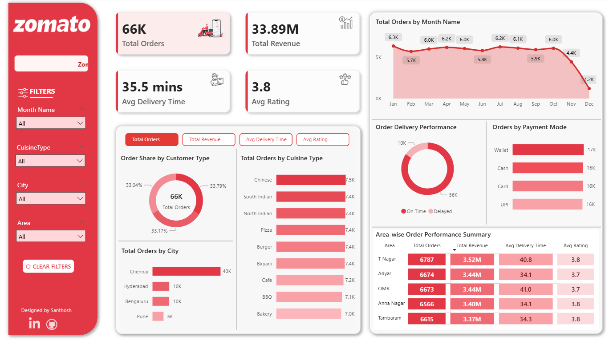
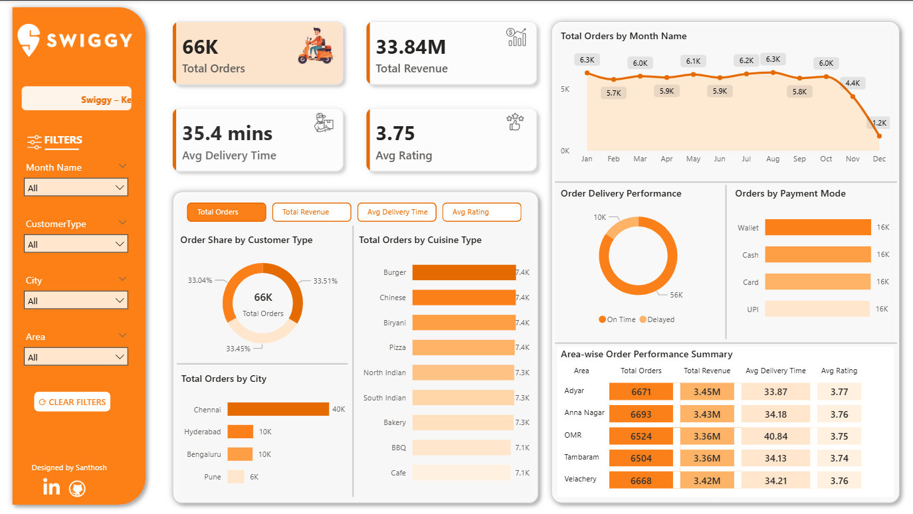
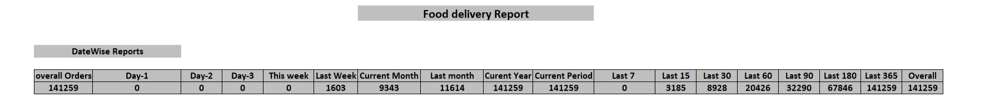
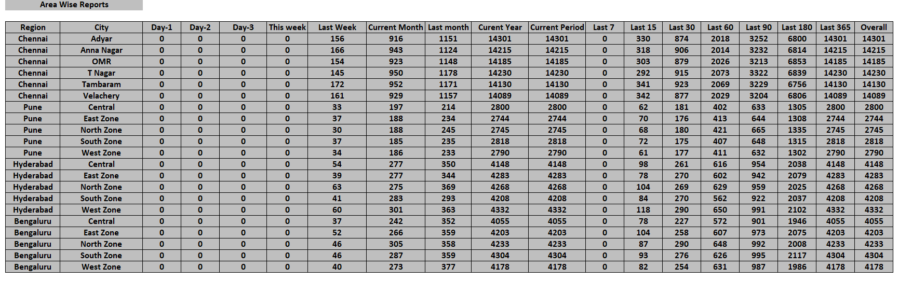
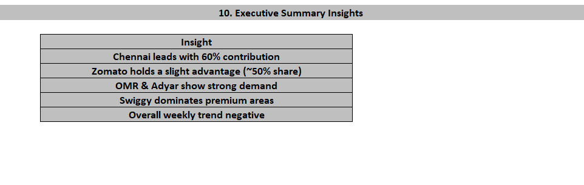

# 🍔 Food Delivery Analytics | SQL • Power BI • Excel

This project is an **end-to-end Food Delivery Analytics system** developed during my **Data Analyst Internship**, where **daily operational data** was received and appended to build **automated reports and dashboards** for business tracking and decision-making.

The project covers **data analysis using SQL**, **interactive dashboards using Power BI**, and **operational reporting using Excel**.

---

## 📌 Project Overview

- Daily food delivery data from **Zomato & Swiggy**
- Data appended **every day** to a historical table
- KPIs auto-updated without changing formulas
- Separate dashboards for **platform performance & operations**

---

## 🎯 Business Objectives

- Track **daily, weekly, monthly, and YTD orders**
- Compare **Zomato vs Swiggy** performance
- Identify **top cities and high-demand areas**
- Analyze **WoW, MoM, YoY growth**
- Support **management & operations teams**

---

## 🛠 Tools & Technologies

| Tool | Usage |
|----|----|
| **SQL (MySQL)** | Data aggregation, trends, window functions |
| **Power BI** | Interactive dashboards & KPIs |
| **Excel** | Daily operational & executive reports |
| **Power Query** | Data cleaning & transformations |
| **DAX** | KPIs, YoY, moving averages |

---

## 📊 Power BI Dashboard Preview

---

### 🔴 Zomato Dashboard
- Total Orders & Revenue
- Avg Delivery Time & Ratings
- Monthly Order Trend
- City & Area-wise Performance
- Cuisine & Payment Mode Analysis
- Interactive filters for **Month, City, Area**

---

### 🟠 Swiggy Dashboard
- Platform-specific KPIs
- Area-wise demand analysis
- Monthly trends
- Delivery performance & payment modes

---

## 🟢 Excel Reports (Operational Reporting)

---

### 📅 Daily & Periodic Performance Report
- Day-1, Day-2, Day-3 Orders
- Last 7 / 15 / 30 / 60 / 90 / 180 / 365 days
- Weekly, Monthly & YTD summaries

---

### 🏙 City & Area-wise Analysis
- City contribution & ranking
- Area-wise platform preference
- Zomato vs Swiggy split
- WoW & MoM growth tracking

---

### 📌 Executive Summary
- Platform market share
- Top demand areas
- Overall trend analysis
- Business-ready insights

---

## 🧠 SQL Analysis Highlights

- Daily, weekly & monthly order tracking
- WoW, MoM & YoY growth calculations
- Rolling averages & moving trends
- City & area ranking using window functions
- Customer retention & repeat analysis
- Platform share % & seasonality analysis

---

## 🔄 Daily Data Workflow

1. Daily order data received
2. New data appended to historical table
3. SQL queries auto-recalculate KPIs
4. Excel & Power BI dashboards refreshed
5. Management reports updated instantly

---

## 🎯 Key Insights

- Chennai contributes **~60% of total orders**
- Zomato holds a **slight market share advantage**
- OMR & Adyar show consistently high demand
- Swiggy dominates premium areas
- Recent weekly trend shows decline in orders

---

## 📬 Contact

**👤 Santhosh Babu S**  
🎯 *Data Analyst Aspirant | SQL | Power BI | Python | DAX | Excel*  

📧 **Email:** [santhoshbabus.analyst@gmail.com](mailto:santhoshbabus.analyst@gmail.com)  
🔗 [**LinkedIn**](https://www.linkedin.com/in/santhoshbabus/) | [**GitHub**](https://github.com/santhoshbabu-analyst)

---

⭐ *If you found this project useful, don’t forget to star the repository!* ⭐
